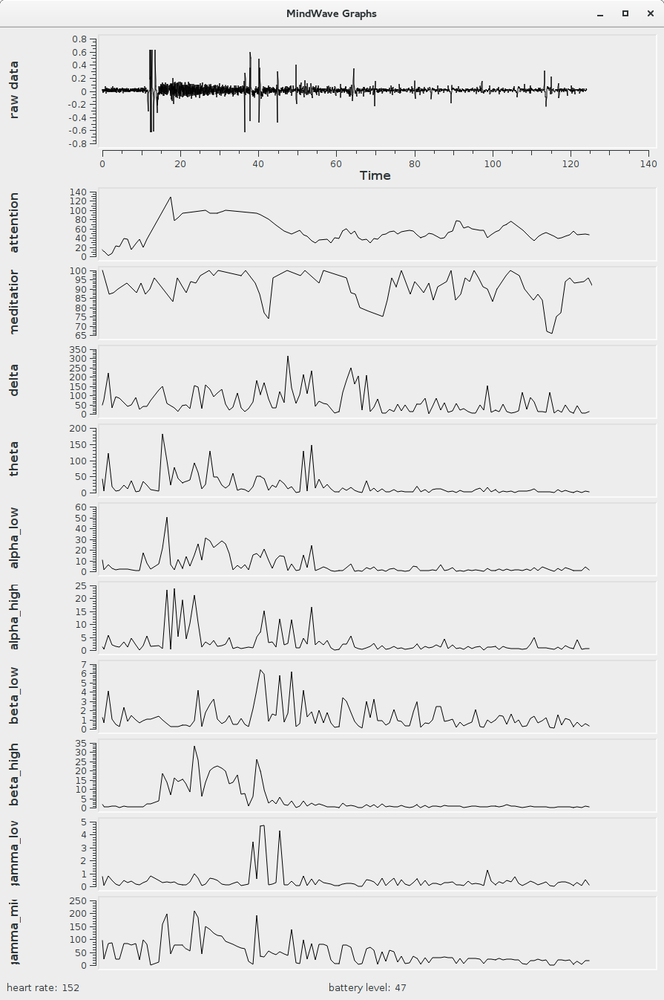

# pymindwave
read and plot data from a NeuroSky MindWave Headset.

Description
-----------

Get & Install
-------------

    git clone https://github.com/frans-fuerst/pymindwave.git
    pymindwave/reader_example.py

    pymindwave/reader_example.py
    mw_graphs_qt.py

Todo
----
* read more available data
* support ID based connections
* make single threaded

Requirements
------------

* Python Python 3+
* `python3-zmq`
* `pyserial`
* `PyQt4`
* `PyQt4.Qwt5`

